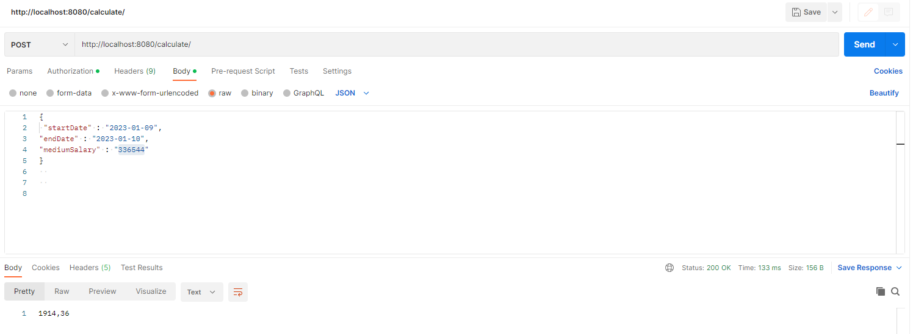

# Проект "Калькулятор отпускных выплат"

## Описание проекта.

Данный проект сделан в рамках тестового задания.

## Стек.

- **Java 11**
- **Spring Boot 2.7.6**
- **lombok**

## Требования.

- **Java 11**
- **Maven 3.8**

## Запуск проекта.

Запуск производится через Main /src/main/java/ru.test.vacationPayCalculator

## Взаимодействие с приложением.
    1. Пользователь отправляет в запросе планируемые даты отпуска и среднегодовой доход. В ответ ему приходит рассчитанная сумма отпускных за указанный период.

## Возможности расширения.
Реализовать даты в базе данных.
Сделать в приложении API для расчета больничных (через добавление еще одной сущности).
Вести учет запросов (через сохранение в БД)

## Контакты.
@vsevolod_prof